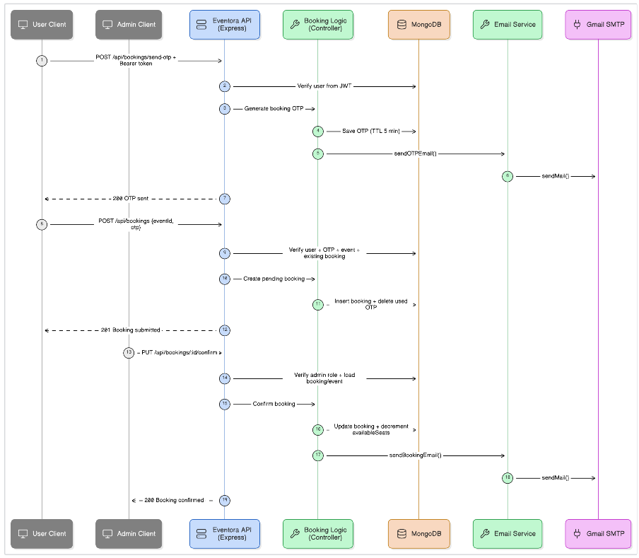
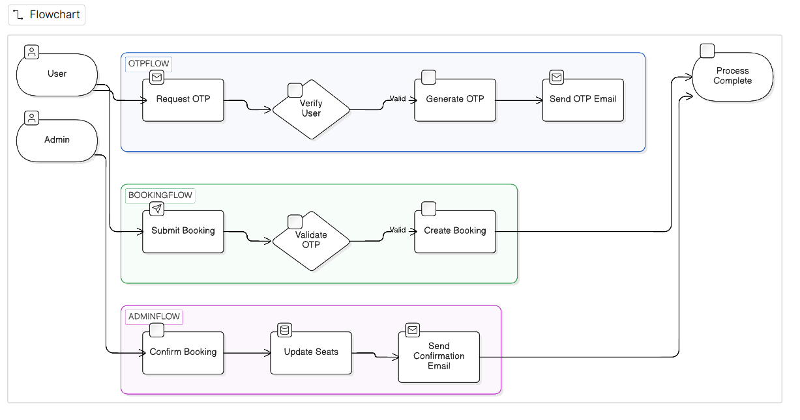

# EventVault 🎟️ — Full-Stack Event Booking Platform

EventVault is a full-stack MERN application that lets users seamlessly browse, register for, and pay for events natively — no third-party booking tools required. It ships with a complete administrative dashboard so event organizers can create and manage both free and paid events, verify bookings, and track revenue in real time.


---

## 📖 Overview

EventVault solves a simple problem: most small-scale event organizers don't need a heavyweight ticketing SaaS — they need a lightweight system to list events, collect booking requests, verify attendees securely, and confirm payments manually without handing off control to a third-party payment processor.

The platform is built around a **request → OTP verification → admin approval** booking flow, giving organizers full control over who gets confirmed, while giving users a transparent view of their booking status at every step.

---

## ✨ Features

### 🔐 Authentication & Security
- Secure login & registration with **JWT** and **bcrypt** password hashing
- Mandatory **email OTP verification** to activate an account on registration (and on delayed/suspicious login attempts)
- Mandatory **email OTP** to finalize and secure any event ticket booking

### 🧑‍🤝‍🧑 Role-Based Access Control
| Role | Capabilities |
|------|-------------|
| **Admin** | Create, edit, and delete events · Approve or reject incoming booking requests · Mark bookings as "Paid" / "Not Paid" · Access strictly locked to database-flagged admin accounts |
| **User** | Browse all events · Submit OTP-verified booking requests · View personal dashboard with live booking status · Cancel pending bookings |

### 📅 Event Management
- Create free or paid events with rich descriptions, external image URLs, dates, categories, and seat capacity
- Full CRUD control for organizers/admins

### 🎫 Smart Booking System
- Every booking request requires 2FA OTP authorization before submission
- All requests — free or paid — enter a secure **Pending** queue for admin verification
- Seat availability is validated and updated atomically to prevent overbooking

### 📊 Admin Analytics Dashboard
- Live tracking of pending requests, total revenue, and total confirmed paid clients — all from a single admin panel

### 📧 Automated Email Notifications
- Booking confirmations and OTPs delivered automatically via **Nodemailer**

### 🎨 UI/UX
- Built entirely with **React** and **Tailwind CSS**
- Polished micro-interactions for a smooth, modern feel

---

## 🖼️ Screenshots

| Data Flow Diagram | Feature Overview |
|:---:|:---:|
|  |  |

---

## 🏗️ Tech Stack

**Frontend:** React, Tailwind CSS, Vite
**Backend:** Node.js, Express.js
**Database:** MongoDB (Mongoose)
**Auth:** JWT, bcrypt, Email OTP (2FA)
**Emails:** Nodemailer
**API Testing:** Postman (collection included in repo)

---

## 🚀 Getting Started

### Prerequisites
- [Node.js](https://nodejs.org/) installed on your machine
- A MongoDB database — [MongoDB Atlas Free Tier](https://www.mongodb.com/cloud/atlas/register) works great

### 1. Clone the repository
```bash
git clone https://github.com/ANURAG2428/EventVault.git
cd EventVault
```

### 2. Configure environment variables
Create a `.env` file inside the `server/` folder:
```env
MONGO_URI=your_mongodb_connection_string
JWT_SECRET=your_jwt_secret_key
EMAIL_USER=your_gmail_address
EMAIL_PASS=your_gmail_app_password
PORT=5000
```
> **Note:** `EMAIL_PASS` requires a Gmail **App Password** (not your regular password) since 2FA blocks standard password logins. Generate one from your [Google Account settings](https://myaccount.google.com/apppasswords).

### 3. Install dependencies & run

**Option A — single command from the root:**
```bash
npm install
npm run install:all
npm run dev
```

**Option B — manually, in two terminals:**
```bash
# Terminal 1 — Backend
cd server
npm install --legacy-peer-deps
npm run dev

# Terminal 2 — Frontend
cd client
npm install
npm run dev
```

The backend runs on **`http://localhost:5000`** and the frontend runs on **`http://localhost:5173`** (default Vite port).

---

## 📬 API Testing

A ready-to-use **Postman Collection** (`EventVault_Postman_Collection.json`) is included in the repo — import it directly into Postman to test every API endpoint.

---

## 📌 Roadmap
- [ ] Razorpay payment gateway integration with webhook handling
- [ ] SMS-based OTP as an alternative to email
- [ ] Event image upload (instead of external URLs)

---

## 👤 Author

**Anurag**
Final-year B.Tech (AI/ML) student | Full-Stack Developer

If you found this project useful, consider giving it a ⭐ on GitHub!

---

## 📄 License

This project is open source and available for learning purposes.
